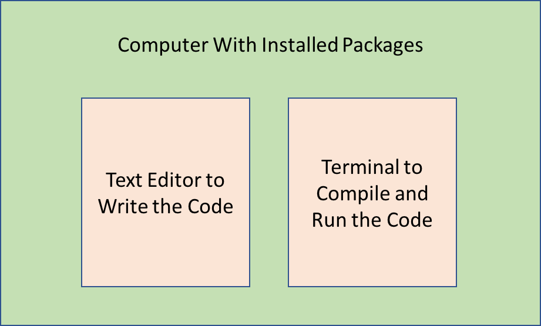
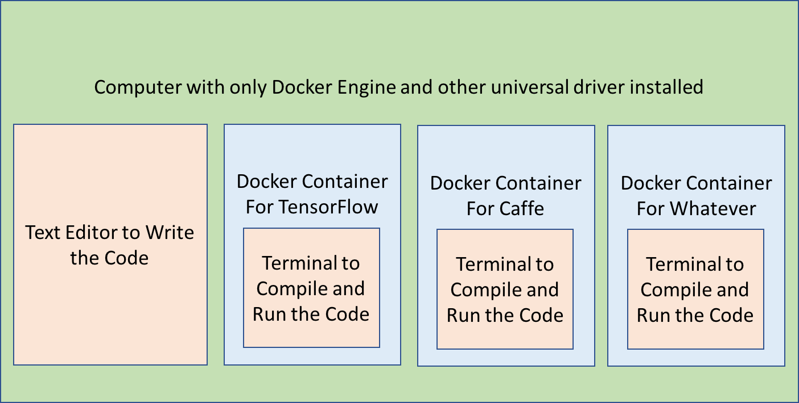
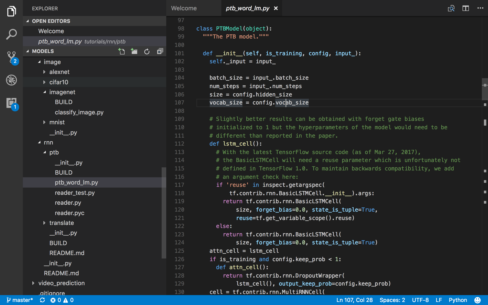
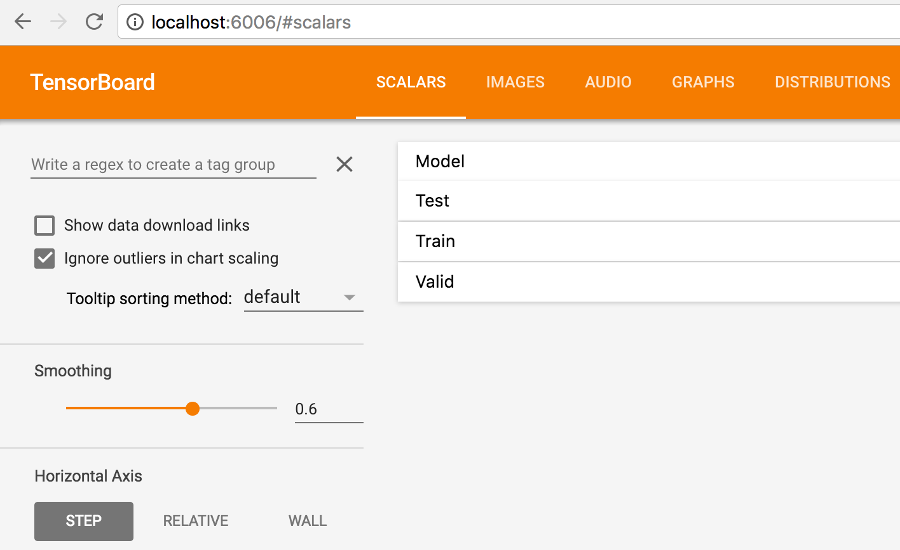

To best describe the motivation for writing this post let me describe the perspectives from two different people:

**The Scientist's Perspective:**

_I am a scientist working on my next deep learning algorithm that's gonna make everyone go like whaaa? Sometimes, I write my algorithm in TensorFlow, sometimes in Torch and sometimes in Caffe. I am also poorly funded and can't afford multiple machines for different setups. My problem is that, all these machine learning frameworks are not in sync and some uses different CUDA versions, drivers, modules etc. than the other. Although I can probably make them work in the same machine by being disciplined and having good practices on putting library paths and symlinks and stuff, I will probably screw things up when it comes to update my system/framework. Also, I don't wanna write installation instructions of all my packages when I release my code to the conference I'm submitting my paper to. I want the scientific community to reproduce my experiment exactly as I did it in my machine. Is there something that can streamline this process?_

**The Software Developer's Perspective:**

_I am a software developer who's sick and tired of installing stuff and just want to run this freaking code and get on with it. Is there something that can streamline this process?_

The answer to their question is, yes. There is a thing called Docker which can streamline this process. Docker is kinda like a virtual machine but it doesn't include the OS, only the settings and minimal stuff that is required to reproduce your setup in another machine. For more on what it is, just read about it in this link: [https://www.docker.com/what-docker](https://www.docker.com/what-docker). Following is my migration process to docker:

Above is my previous workflow. I have a computer with all the packages locally installed. I have a text editor where I write and edit my source code. And I have a terminal to compile and run the source code. The problem comes when I have conflicting packages for different kinds of source code I'm working on. For instance, in my work, some source codes are dependent on specific versions of CUDA. Our CS Java class at RIT one semester was in java version 1.7 and the next semester in java 1.8. Some people have moved to python 3 and some are still using python 2. Hence, in the above workflow, avoiding such conflicts is messy. Following is my current workflow:In this workflow, I have a computer with only Docker Engine and universal drivers such as the display driver, installed. The only difference now is that I don't have all the packages such as python 2/python 3 locally installed, but installed in Docker Containers. I have different docker containers for different development projects. For instance, the Docker container for TensorFlow has python 2 by default, CUDA 8 and other TensorFlow specific packages installed, whereas the Docker container for Caffe has it's own specification. Hence, after I write my code in the text editor locally, I run that code in it's specific docker container.

Following is a step by step process of how I write code in TensorFlow. You can adopt the same process for whatever project you are working on:

**Step 1: Edit the code**

So for instance, here is a code for a model that I'm writing in Visual Studio Code. You might be writing some code for finding the solutions of some differential equations with Runge-Kutta solver in C. Write that code first in an editor. I am still not settled on a single editor. People use Vim, Emacs, Spacemacs, Visual Studio Code, Atom, Sublime, etc... the list goes on.

**Step 2: Get the Docker Container**

Assuming you have installed docker engine in your machine \([https://docs.docker.com/engine/installation/](https://docs.docker.com/engine/installation/)\), now you have to get a docker container. A docker container is an image. You can either build this image from the scratch \(which I'll describe in a different post. You can even use multiple images and stack them up and make a single image to your requirements\) or you can get this image from a repository \([https://store.docker.com/search?q=&source=verified&type=image](https://store.docker.com/search?q=&source=verified&type=image)\). For now, I'll get the TensorFlow image with the following command in a terminal:

```bash
docker run -it gcr.io/tensorflow/tensorflow:latest-devel bash
```

or \(this command will just pull it, but not run it\)

```bash
docker pull gcr.io/tensorflow/tensorflow:latest-devel
```

The command pulls the image from the repository and puts it locally in your machine and runs a bash shell in it as follows:

```bash
Syeds-MBP:ptb luna$ docker run -it gcr.io/tensorflow/tensorflow:latest-devel bash
Unable to find image 'gcr.io/tensorflow/tensorflow:latest-devel' locally
latest-devel: Pulling from tensorflow/tensorflow
892cc5bfc051: Already exists 
f3eda43ea55a: Already exists 
646005d97ff4: Already exists 
44d770c1f7bd: Already exists 
1ce0c4bfe746: Already exists 
b98b28b649a2: Pull complete 
dbcb14adf008: Pull complete 
18aa19fe8596: Pull complete 
7882fa001225: Pull complete 
cde898c339f7: Pull complete 
05db1985de18: Pull complete 
3ede8b995134: Pull complete 
7e09e41c9d96: Pull complete 
c3c542fce062: Pull complete 
2c4b672418c8: Pull complete 
Digest: sha256:2b3ab8cbcdd08fb93fc3b4e821ea366c2155a5af9441acfc03f927071b202a19
Status: Downloaded newer image for gcr.io/tensorflow/tensorflow:latest-devel
root@2bef7283910f:~# python
```

If you now open and type python or give some other commands, you can see what is installed in this container For instance, in the following, you can see the TensorFlow container start python 2 by default, has TensorFlow version 1.2.0, has bazel 0.4.5 installed, java 1.8 and g++ 5.4.0 compiler. **And you had to copy-paste only one command to get all of those! **That sure solved some of the installation problems our two subjects were having :\)

```python
root@2bef7283910f:~# python
Python 2.7.12 (default, Nov 19 2016, 06:48:10) 
[GCC 5.4.0 20160609] on linux2
Type "help", "copyright", "credits" or "license" for more information.
>>> import tensorflow as tf
>>> tf.__version__
'1.2.0'
>>> exit()
root@2bef7283910f:~# bazel version
Build label: 0.4.5
Build target: bazel-out/local-fastbuild/bin/src/main/java/com/google/devtools/build/lib/bazel/BazelServer_deploy.jar
Build time: Thu Mar 16 12:19:38 2017 (1489666778)
Build timestamp: 1489666778
Build timestamp as int: 1489666778
root@2bef7283910f:~# javac -version
javac 1.8.0_131
root@2bef7283910f:~# g++ -v
Using built-in specs.
COLLECT_GCC=g++
COLLECT_LTO_WRAPPER=/usr/lib/gcc/x86_64-linux-gnu/5/lto-wrapper
Target: x86_64-linux-gnu
Configured with: ../src/configure -v --with-pkgversion='Ubuntu 5.4.0-6ubuntu1~16.04.4' --with-bugurl=file:///usr/share/doc/gcc-5/README.Bugs --enable-languages=c,ada,c++,java,go,d,fortran,objc,obj-c++ --prefix=/usr --program-suffix=-5 --enable-shared --enable-linker-build-id --libexecdir=/usr/lib --without-included-gettext --enable-threads=posix --libdir=/usr/lib --enable-nls --with-sysroot=/ --enable-clocale=gnu --enable-libstdcxx-debug --enable-libstdcxx-time=yes --with-default-libstdcxx-abi=new --enable-gnu-unique-object --disable-vtable-verify --enable-libmpx --enable-plugin --with-system-zlib --disable-browser-plugin --enable-java-awt=gtk --enable-gtk-cairo --with-java-home=/usr/lib/jvm/java-1.5.0-gcj-5-amd64/jre --enable-java-home --with-jvm-root-dir=/usr/lib/jvm/java-1.5.0-gcj-5-amd64 --with-jvm-jar-dir=/usr/lib/jvm-exports/java-1.5.0-gcj-5-amd64 --with-arch-directory=amd64 --with-ecj-jar=/usr/share/java/eclipse-ecj.jar --enable-objc-gc --enable-multiarch --disable-werror --with-arch-32=i686 --with-abi=m64 --with-multilib-list=m32,m64,mx32 --enable-multilib --with-tune=generic --enable-checking=release --build=x86_64-linux-gnu --host=x86_64-linux-gnu --target=x86_64-linux-gnu
Thread model: posix
gcc version 5.4.0 20160609 (Ubuntu 5.4.0-6ubuntu1~16.04.4)
```

But now you might be saying, I don't see my code in here. How do I get my code in this container? So the answer lies in how we issued the docker run command. Since this is a container and is a closed system, we need to **mount** our local folder into this container. Similarly, if we want to do some networking stuff, we would have to open the port in the local machine to this container  with the docker run command. You can learn all the options that can be passed to docker run command in here: [https://docs.docker.com/engine/reference/run/](https://docs.docker.com/engine/reference/run/). For now type **exit** and go to step 3.

**Step 3: Running Docker**

To run a docker container, you need to identify which docker container to run. You can find out about available docker containers in your machine using the following command:

```bash
Syeds-MBP:ptb luna$ docker images
REPOSITORY                     TAG                 IMAGE ID            CREATED             SIZE
gcr.io/tensorflow/tensorflow   latest-devel        61c8843c7545        9 days ago          1.78 GB
```

You can see that our docker container has a repository name, tag, image ID. You can run this container as follows:

```bash
docker run -it gcr.io/tensorflow/tensorflow:latest-devel bash
```

or with directly with the image id.

```bash
docker run -it 61c8843c7545 bash
```

But our run command is not complete yet. We need to expose port 6006. So let's do that by adding `-p HostPort:ContainerPort` argument as follows:

```bash
docker run -it -p 6006:6006 61c8843c7545 bash
```

Now we need to mount our source code directory with a `-v SourceDirectory:ContainerDirectory` argument. Hence, our final run command is as follows:

```bash
Syeds-MBP:ptb luna$ docker run -it -p 6006:6006 -v /Users/luna/workspace/models/:/root/workspace 61c8843c7545 bash
root@89ce92fb9880:~# ls
workspace
root@89ce92fb9880:~# cd workspace/
root@89ce92fb9880:~/workspace# ls
AUTHORS            WORKSPACE           cognitive_mapping_and_planning  inception                         neural_gpu             resnet         swivel       tutorials
CONTRIBUTING.md    adversarial_crypto  compression                     learning_to_remember_rare_events  neural_programmer      setup.py       syntaxnet    video_prediction
ISSUE_TEMPLATE.md  adversarial_text    differential_privacy            lfads                             next_frame_prediction  skip_thoughts  tags
LICENSE            attention_ocr       domain_adaptation               lm_1b                             object_detection       slim           textsum
README.md          autoencoder         im2txt                          namignizer                        real_nvp               street         transformer
root@89ce92fb9880:~/workspace#
```

Now you can see that your local source folder is mounted in a folder inside the container. Since, the local folder is mounted, any change you make in the local folder is going to reflect inside the container and any change you make inside the container is going to reflect in the local folder. Just beware of changing permission and doing git push/pull inside the container as this might screw things up in your workflow. Just keep things clean and edit the source code locally, do git commit/pull/push locally and only run and compile code in this development workflow \(the next post will talk about building docker images and how you can build on top of this image and add features to this image\).

**Step 4: Run the source code in the docker container**

Assuming you have edited the source code, let's run the code in the docker container as follows. I'm going to run the ptb word model as follows:

```bash
root@89ce92fb9880:~/workspace/tutorials/rnn/ptb£ python ptb_word_lm.py --data_path=simple-examples/data/ --model=small --save_path=./  
2017-06-24 09:53:40.418532: W tensorflow/core/platform/cpu_feature_guard.cc:45] The TensorFlow library wasn't compiled to use SSE4.1 instructions, but these are available on your machine and could speed up CPU computations.
2017-06-24 09:53:40.418576: W tensorflow/core/platform/cpu_feature_guard.cc:45] The TensorFlow library wasn't compiled to use SSE4.2 instructions, but these are available on your machine and could speed up CPU computations.
2017-06-24 09:53:40.418586: W tensorflow/core/platform/cpu_feature_guard.cc:45] The TensorFlow library wasn't compiled to use AVX instructions, but these are available on your machine and could speed up CPU computations.
2017-06-24 09:53:40.419125: W tensorflow/core/platform/cpu_feature_guard.cc:45] The TensorFlow library wasn't compiled to use AVX2 instructions, but these are available on your machine and could speed up CPU computations.
2017-06-24 09:53:40.419173: W tensorflow/core/platform/cpu_feature_guard.cc:45] The TensorFlow library wasn't compiled to use FMA instructions, but these are available on your machine and could speed up CPU computations.
Epoch: 1 Learning rate: 1.000
0.004 perplexity: 7284.361 speed: 913 wps
0.104 perplexity: 856.644 speed: 1090 wps
```

Now let's make use of that exposed port using the following command and browsing to [https://localhost:6006](https://localhost:6006) in our local browser:

```bash
root@89ce92fb9880:~/workspace/tutorials/rnn/ptb£ tensorboard --logdir=./
Starting TensorBoard 54 at https://89ce92fb9880:6006
(Press CTRL+C to quit)
```

As you can see, you got tensorboard opened up through port 6006:  


**Conclusion**

So that's it. Edit the code locally, build and run in the container, and save experiment results from the container to the host. I have specifically used a development workflow from deep learning, but you can adopt this workflow for any kind of development. For instance, if you are doing web development with React or Angular, you can pull a container which has the required dependency like node, babel etc. and write you source code locally and run it in the container. Same goes for scientists who are writing high performance computing code. You can create a container with all the required packages and do the same. In the next post, I'll talk about how you can build your custom container. For now, this is it.
